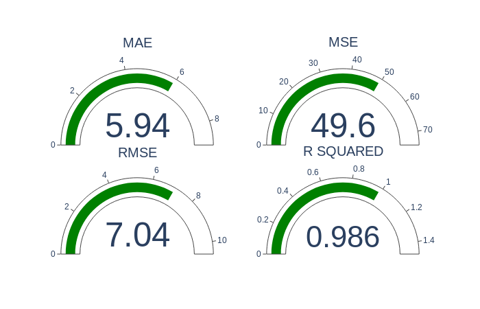

### Machine Learning scorring

Most common **ML** scoring functions.

Created sysntetic data points using numpy. First I created a 2D line, then added noise:

### Machine-Learning errors



Github project structure

```
├── environment.yml
├── eval_error.py
├── linear_regression.ipynb
├── plotly_linear_model.ipynb
└── README.md
```

### Description

* environment.yml contains the project specifications
* eval_error.py python script calculates the errors 
*.ipynb are two jupyter-notebooks mostly used for graphing


References:  
* https://docs.scipy.org/doc/numpy-1.13.0/user/basics.creation.html
* https://pythonbasics.org/matplotlib-line-chart/
* https://stackoverflow.com/questions/14058340/adding-noise-to-a-signal-in-python#14058425
